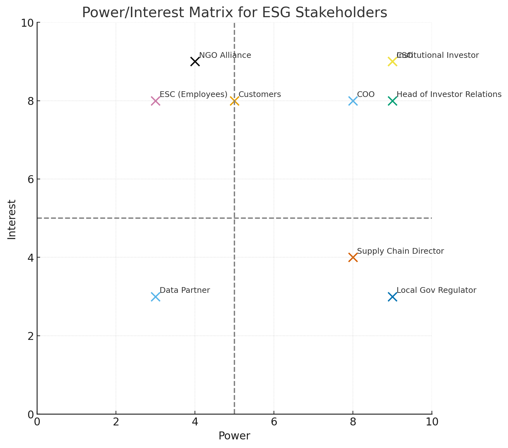

# Stakeholder Engagement Plan

## 1. Stakeholder Mapping

### Key Stakeholders (8–10)
1. **Chief Sustainability Officer (CSO), GlobalCorp**
2. **Head of Investor Relations, GlobalCorp**
3. **NGO Alliance for Sustainable Futures**
4. **Local Government Environmental Regulator**
5. **Chief Operations Officer (COO), GlobalCorp**
6. **Employee Sustainability Committee (ESC)**
7. **Supply Chain Director, GlobalCorp**
8. **Institutional Investor, Green Capital Partners**
9. **Customers (B2B corporate clients)**
10. **Data & Analytics Partner Firm**

### Power/Interest Matrix

### Top 3 Priority Relationships
1. **Chief Sustainability Officer (CSO)**
2. **Head of Investor Relations**
3. **Institutional Investor (Green Capital Partners)**

---

## 2. Communication Planning

### 1. Chief Sustainability Officer (CSO)
- **Key Questions/Concerns:** ESG strategy alignment, credibility of methodology.
- **Format & Frequency:** Bi-weekly calls, monthly summaries.
- **Potential Conflicts:** Strategy vs. operational realities.

### 2. Head of Investor Relations
- **Key Questions/Concerns:** Investor confidence, risk communication.
- **Format & Frequency:** Monthly reports, quarterly decks.
- **Potential Conflicts:** Simplified narratives vs. methodological detail.

### 3. Institutional Investor (Green Capital Partners)
- **Key Questions/Concerns:** ESG ratings alignment, data transparency.
- **Format & Frequency:** Quarterly meetings, secure data room.
- **Potential Conflicts:** Requests for excessive disclosure.

---

## 3. Trust Building Strategy

### Transparency Mechanisms
1. Methodological white paper.
2. Open-data summaries.
3. Audit trail documentation.

### Timing for Stakeholder Input
- Methodology: CSO, NGO.
- Preliminary insights: Investor Relations, ESC.
- Final interpretation: Institutional Investor, Regulator.

### Feedback Loops
- Surveys after meetings.
- Quarterly workshops.
- Rotating advisory group.

---

## 4. Capstone Connection
This plan ensures insights:
- Reach decision-makers.
- Build trust with transparency.
- Balance conflicting priorities.

**Timeline Snapshot:**
- Weeks 1–2: Methodology input.
- Weeks 3–5: Preliminary results & workshops.
- Weeks 6–8: Final reporting.
- Ongoing: Quarterly & annual reviews.
